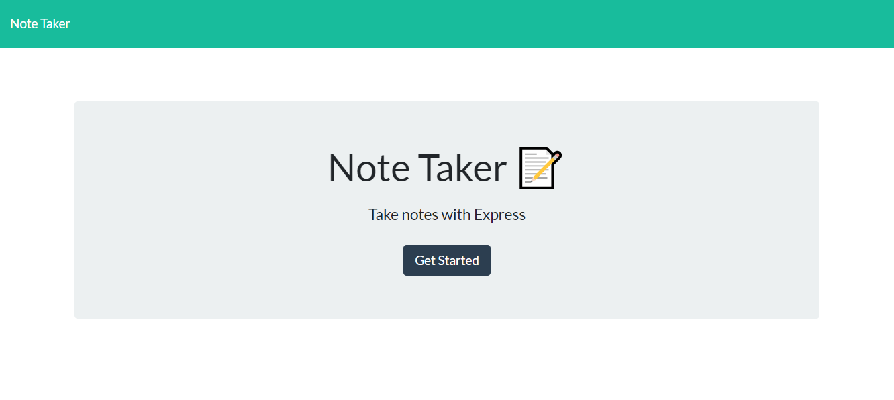
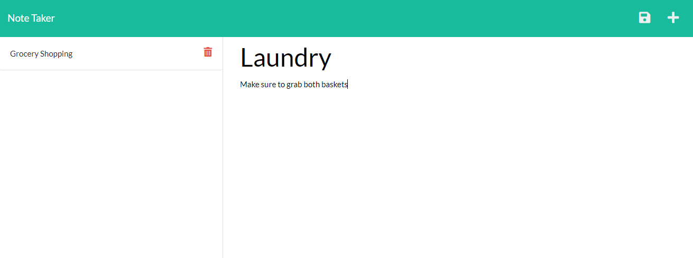

# Note Taker

## Description
This Note Taker application allows a user to write, save, and retrieve notes from a heroku server. For this application I used Express.js that saves and retrieves the users note data from a JSON file. 

## Usage
### You can see the deployed application [here](https://agile-dawn-65446.herokuapp.com/)!
After selecting "Get Started" as shown on the landing page preview above, the user will be greeted with this page that includes a default note example on the left and a blank text area on the right. In this text area you can write your own notes. In order to save your current note, click on the save icon at the top right! It will appear underneath the "Grocery Shopping" list item on the left.

You can click on any list item to the left if you want to view the description again. In order to create a new note after viewing one, simply click on the plus (+) icon on the top right of the screen.

